# Introduction

Project 15 enable efforts to quickly get started with a foundation for a IoT solution. Devices can be provisioned and managed trough the P15 portal and it displays live events and telemetry as text as well as with Time Series Insights and on map.  

Added to the Open Platform is the integration of TinyML models to the managed devices, both the process of model training with Edge Impulse and manage the deployment with P15.

## Outline

- Train and production scenarios
- Use case - Smart Parks
- What is added to Open Platform in this version
- Guide "Edge Impulse with P15":
    - Azure deploy of Open Platform
    - Connect Edge Impulse Project
    - Set EI model to device twin
    - Edge Impulse CLI (special version):
        - Stream training Telemetry
        - Stream inference Telemetry
    - Use Plug and Play (PnP) model
- Update ML model/Firmware 
    - With serial connector
    - with BLE connect app

Scenarios covered:
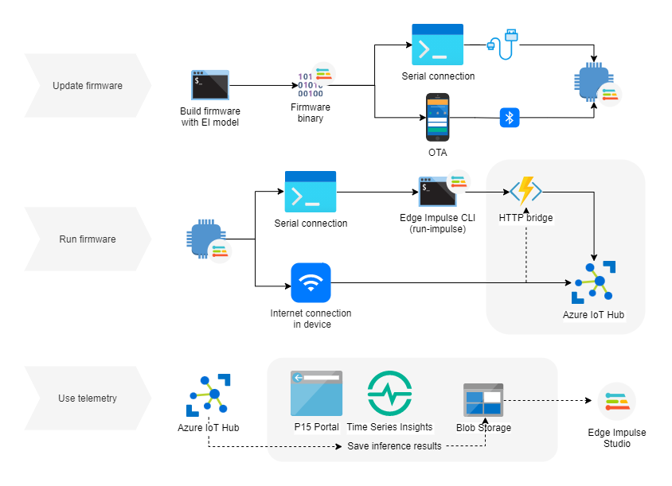


(draft image)

&nbsp;

## Train and production scenarios

Two types of firmware:
1. Firmware outputting raw data to collect training data
    - firmware as [edgeimpulse/example-dataforwarder-zephyr](https://github.com/edgeimpulse/example-dataforwarder-zephyr)
    - while this data is streaming, tooling like the [data-forwarder by Edge Impulse](https://docs.edgeimpulse.com/docs/cli-data-forwarder) can sample the data to gather sequences of data, e.g. 2 seconds of accelerometer data and label it. 
2. Firmware running inference: optimized firmware to analyze the raw data *on device* to send only events to the cloud.
    - firmware as [edgeimpulse/firmware-nrf52840-5340-dk](https://github.com/edgeimpulse/firmware-nrf52840-5340-dk)

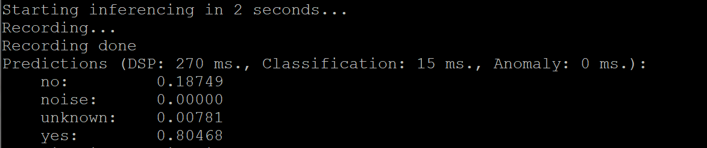

These two scenarios are often relevant to the same project, the data collection firmware in the development stage, and the optimized inference firmware in production mode.

### Device connectivity (move)

[Device communication protocols](https://docs.microsoft.com/en-us/azure/iot-hub/iot-hub-devguide-protocols)

&nbsp;

## Use case - SmartParks

(draft) Edge Impulse works together with Smart Parks, Irnas and others to analyze motion and sound data of Elephants to classify and generate events. This adds another layer to the very efficient GPS tracking and LoRaWAN connectivity of the OpenCollar.

The collar hardware is based on the device *Nordic Semi nRF52840 DK* which is also compatible with Edge Impulse see [the documentation](https://docs.edgeimpulse.com/docs/nordic-semi-nrf52840-dk).

The Edge Impulse firmware for this development board is open source and hosted on GitHub: [edgeimpulse/firmware-nrf52840-5340](https://github.com/edgeimpulse/firmware-nrf52840-5340).


(temporary image?)

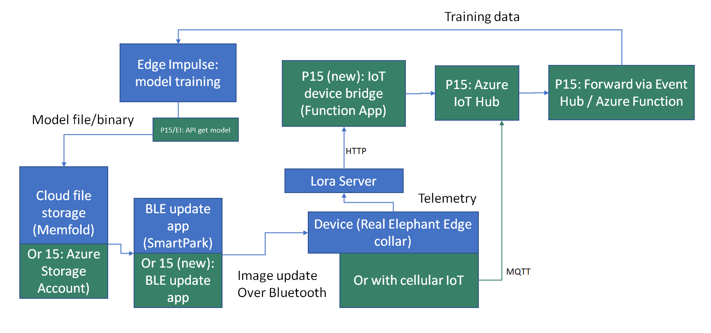
(old image, replace but keep idea about use case VS in general)

&nbsp;

## Added to P15 in the Edge Impulse integration

(IN PROGRESS)
- Module in Web Portal for Edge Impulse connection and actions (UI + backend)
    - Sample project in Edge Impulse made public
- File upload to P15 IoT Hub (via Azure Function)
- (Functionallity to save telemetry to Storage Account and forward it to Edge Impulse)

To demonstrate how it can be adjusted to the case of adding Edge Impulse models and in particlar the use case of SmartParks and their Elephant Collar, the following changes will direct to the demo code:
- url and branch in `PrivateModelRepo`
- url for *webApp* and *functions* in `git-repo`

**File upload/Telemetry (training data upload)**
- Enable File Upload in IoT Hub by connecting a Storage Account to it. 
- Use added function in `project15-openplatform-functions` HTTP endpoint

    - Ingest from Azure Blob Storage
    - Ingest from http POST request

This endpoint makes a POST request to `http://ingestion.edgeimpulse.com/api/training/data`

&nbsp;

# Guide - Integrate EI to Project 15


## Azure deploy of Open Platform (P15)

Project 15 is quickly set up in Microsoft Azure by the provided ARM template. Ajustments done is covered in the section *What is added to Open Platform in this version*

### Open ARM Template Deployment

Click **Deploy to Azure** button below. (TIP: right click the button below and select *Open link in new tab/window*) 

<a href="https://portal.azure.com/#create/Microsoft.Template/uri/https%3A%2F%2Fraw.githubusercontent.com%2FSaraOlsson%2Fproject15%2Fmaster%2FEdge-Impulse-Guide%2Fazuredeploy.json" target="_blank"></a>

&nbsp;

## Connect Edge Impulse Project to P15

> Note that documentation about how to provision devices can be found at the project15 repo: [Connect IoT devices to the Open Platform](https://github.com/microsoft/project15/blob/master/Deploy/ConnectingDevice.md)

Training of TinyML model takes place in the Edge Impulse studio. Added to P15-EI is a widget in the web portal to connect a Edge Impulse project by entering the project id. 

Choosing a model project will enable to 
- view model type and classes
- build and prepare firmware for update of IoT device

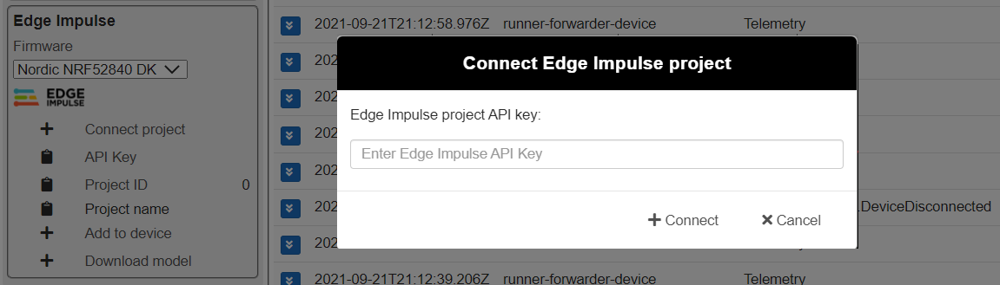

&nbsp;

## Set EI model to device twin

After being connected to an Edge Impulse project, choooe a device in the Device Selection and the *Add to device* button will be enabled. Pressing this button triggers a change in the deviceTwin tags section.

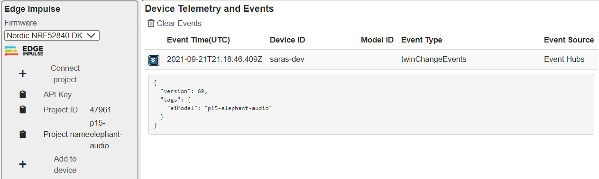

&nbsp;

## Edge Impulse CLI (special version)

Adjusted version at GitHub: [SaraOlsson/edge-impulse-cli](https://github.com/SaraOlsson/edge-impulse-cli)

Two tools are added to the CLI
- edge-impulse-az-data-forwarder
- edge-impulse-run-impulse-az-forwarder
Which both forwards the data to an endpoint in the Project 15 backend.

To use this version of the Edge Impulse CLI, please see the README of the edge-impulse-cli repo linked above.

### Stream training Telemetry

Copy the device connection string from the P15 Portal (or directly from IoT Hub)

```edge-impulse-az-data-forwarder```

In the condig dialog, enter the device connection string.

Go to Edge Impulse studio (a link will be shown in the termimal). Enter a label for the data that you want to collect and press *Start sampling* 

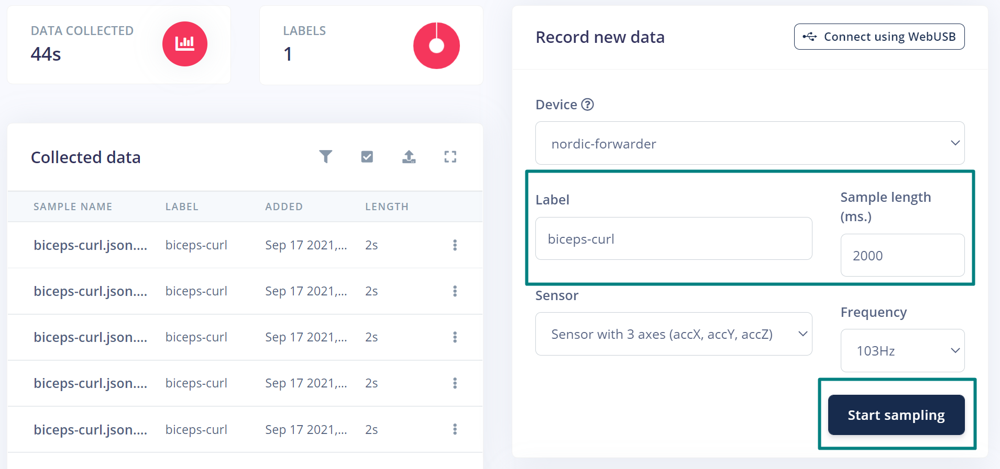
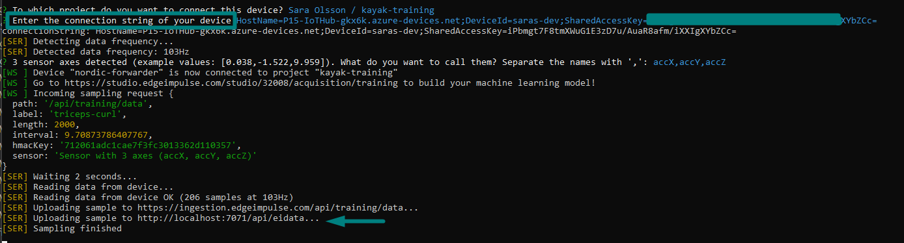

&nbsp;

### Stream inference Telemetry

> Note: if your devive as options to communicate directly with the cloud, you may implement Azure IoT Hub messaging directly in the firmware

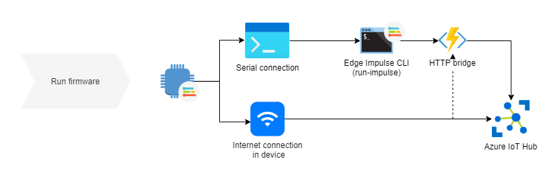

Flash inferece firmware to the device. For example, the export of the Edge Impulse pre-built firmware of the dk

```edge-impulse-run-impulse-az-forwarder --classes <class1_class2_class3> --az-device <your-connectionstring>```

<!-- 
edge-impulse-run-impulse-az-forwarder --classes no_noise_unknown_yes --az-device HostName=P15-IoTHub-gkx6k.azure-devices.net;DeviceId=runner-forwarder-device;SharedAccessKey=61+uCly4eZuEaLjdH/ynnzRHoG7RvCESczKNsydJmP4= -->

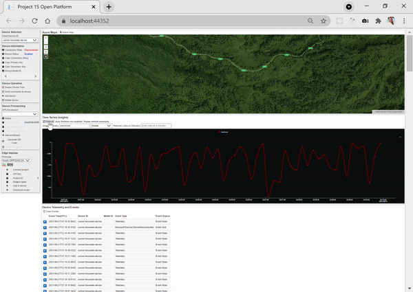

<!-- 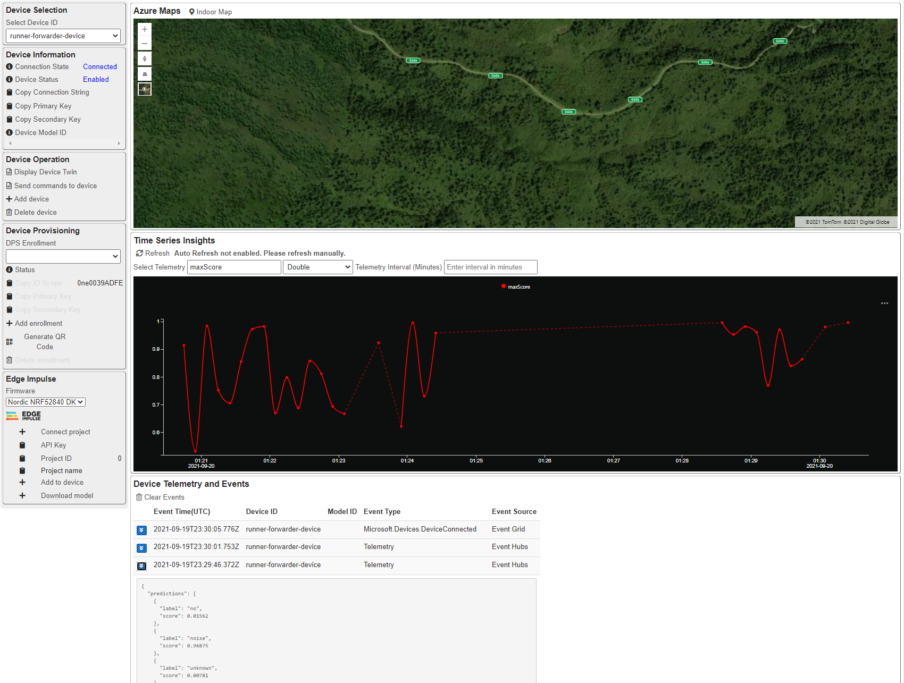 -->
*View EI runner in Project 15 Portal. Using this, it is possible to get time series insights on metrics, like the maximum score value over time. 

## Save telemetry

(TODO: write about saving telemetry)

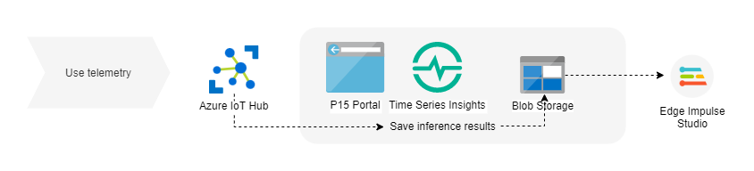

<!-- The dashed line will inform about lack of data/connectivity.* -->

&nbsp;

## Use Plug and Play (PnP) models

- eidataforward-1.json
- eirunnerforward-1.json

Use to be compatible with Azure IoT Central and to get an understanding of the device firmware/hardware.
In the P15 portal, it is beneficial to automatically get Time Series Insights in the P15 portal, or to send custom commands like the example shown below:

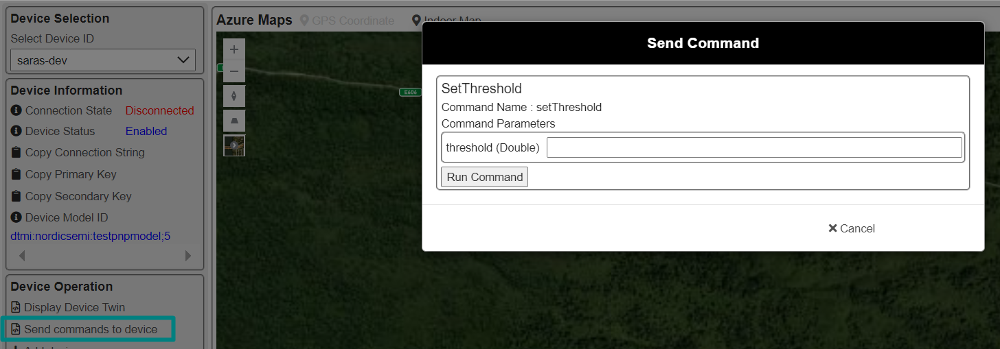


## Plug and Play model

A PnP model describes what telemetry is expected and what actions can be made from cloud to device. An example of how the Elephant Edge collar device is easily managed with a PnP model is described.

OpenCollarElephant model which is found at the [iot-plugandplay-models](https://github.com/SaraOlsson/iot-plugandplay-models/blob/main/dtmi/nordicsemi/OpenCollarElephant.json) repository

&nbsp;

## Get Edge Impulse model 

(Download model from the Portal or backend)

Below are public made sample projects in the Edge Impulse Studio:

- [p15-elephant-audio](https://studio.edgeimpulse.com/public/47961/latest)

### Edge Impulse API

In the [Edge Impulse API](https://docs.edgeimpulse.com/reference#edge-impulse-api), we can use the [download endpoint](https://docs.edgeimpulse.com/reference#downloadbuild), where the *type* parameter implies which microcontroller the firmware is built for, or what library the model is packaged as. 

`https://studio.edgeimpulse.com/v1/api/{projectId}`

- Get your project id from Edge Impulse studio.
- Look up what *type* you need, for example: 
    - *nordic-nrf52840-dk*  
    - *zip* for C++ library  
    - *openmv* for OpenMV library 
    - *runner-linux-aarch64* for embedded Linux


&nbsp;

## Update ML model/Firmware with BLE connect app


**Flashing firmware**
- download built firmware from Edge Impulse or as library to build your custom firmware.
- use microcontroller with Bluetooth or connect with over serial port.

&nbsp;

# SmartParks integration details

(todo) Describe how messages where routed through Lora application to Azure IoT Hub in the Open Platform, how the telemetry can be translated into a PnP model. How the firmware is compatible with same device as Edge Impulse. How the SmartParks BLE connect app is used for DPU over the air.

## Usage with Lora messages

Alternatives:
- Azure IoT Hub integration at The Things Network
- Use IoT Bridge by Azure (forward Lora messages with HTTP via Azure Function to IoT Hub) 

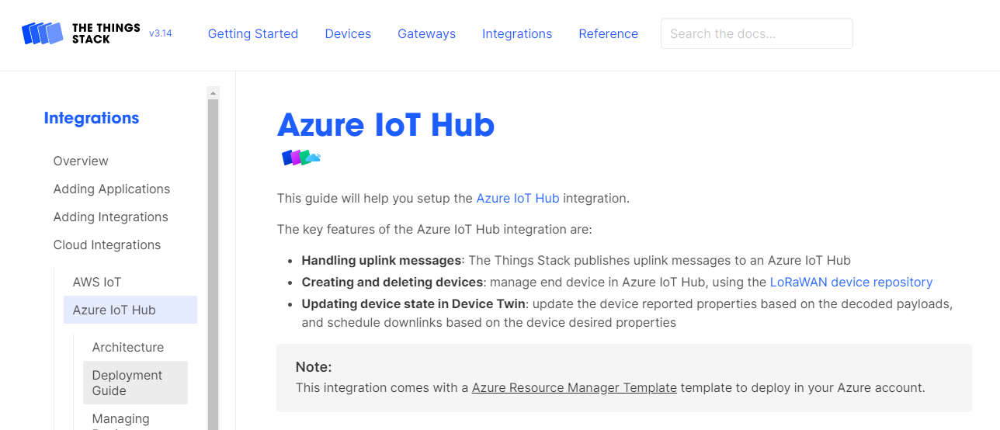